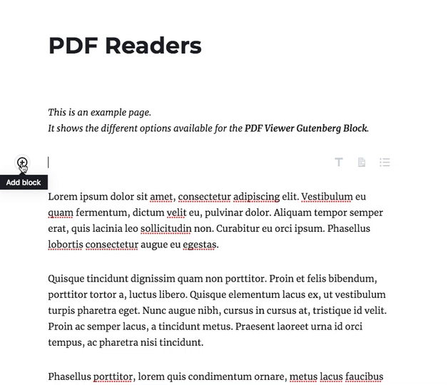
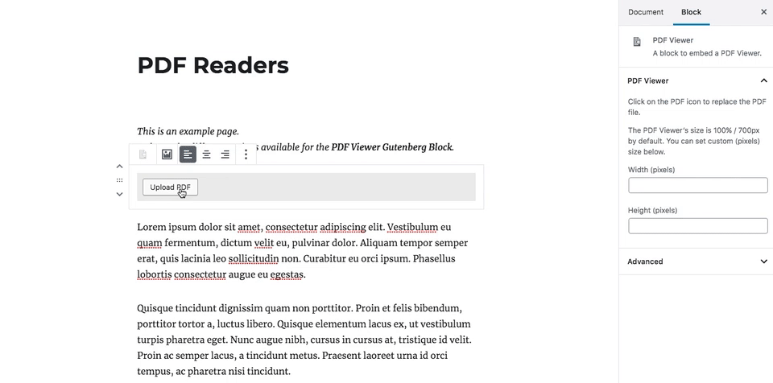

# PDF Viewer Block for WordPress

A simple yet powerful WordPress plugin that adds a PDF Viewer block to the Gutenberg editor, allowing you to embed PDF documents directly into your content.

## Features

- Easy to use PDF Viewer block for the WordPress block editor
- Embed PDFs directly in your content - no more downloading required!
- Fully responsive design that works on all devices
- Customizable width and height settings
- Built on Mozilla's PDF.js for reliable PDF rendering
- No third-party services or external dependencies required
- Clean, lightweight implementation

## Installation

1. Upload the plugin files to the `/wp-content/plugins/pdf-viewer-block` directory, or install the plugin through the WordPress plugins screen directly
2. Activate the plugin through the 'Plugins' screen in WordPress
3. In the block editor, search for "PDF Viewer" and add the block to your content
4. Upload a PDF document or select one from your media library
5. Adjust the width and height in the block settings if needed

## Screenshots

## Requirements

- WordPress 5.0 or higher
- Gutenberg editor enabled

## License

This plugin is licensed under the GPL v2 or later.

This plugin uses [Mozilla's PDF.js](https://mozilla.github.io/pdf.js/) library for rendering PDFs.
